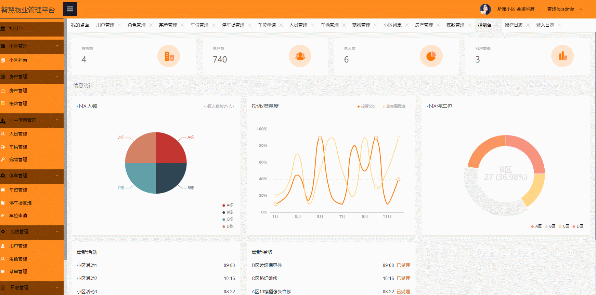
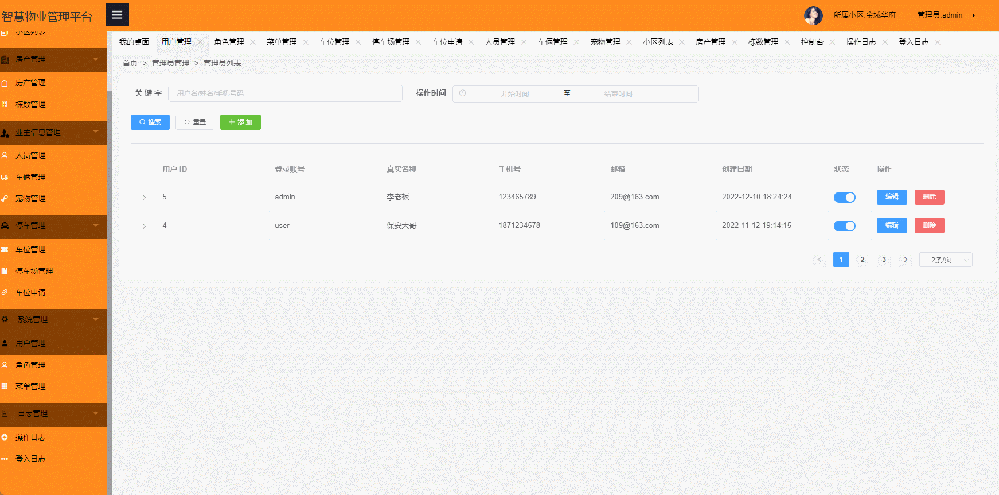

# smart-property🎂

基于SpringBoot+Thymeleaf的智慧物业管理系统

## 介绍🌞

> 该系统集成了小区管理、房产维护、业主服务、服务优化以及车位调配等一系列核心功能，其目的在于显著改进物业管理的效能，提升工作效率，同时实现运营成本的降低。具体来说，该系统不仅能助力物业公司更加高效地收取物业费，还有助于拓展服务边界和提升服务能力，为住户带来更为顺畅、高效的服务体验，从而增强住户的满意度。此外，这一系统也为物业公司开创了新的盈利方式。如租赁中介、社区团购等增值服务，进一步拓展了物业公司的盈利空间。对于住户而言，他们可以通过系统在线支付物业费、水电费、停车费等生活费用，享受更加便捷、快速的支付体验。


## 项目演示🌞

> 管理员





> 其他用户（保安）


## 安装教程🌞

```
1. 运行环境准备mysql8 + java8

2. 配置maven路径，加载依赖

3. 运行sql文件，确保application.yml或config.properties的数据库名称和账号密码是数据库所在主机的账号密码
```


## 使用说明🌞

```
1. 登入

    管理员账号：admin 密码：123456

    其他用户（保安）账号：user 密码：123456
  
2. 运行流程

SpringBoot+Vue项目的部署详情可以查看这篇CSDN博客：http://t.csdnimg.cn/kpuxS

前后端不分离项目的部署流程可以查看这篇CSDN博客：http://t.csdnimg.cn/CslA5
```


## CSDN项目合集🌞

点击前往：http://t.csdnimg.cn/Q4u84


## 联系我🌞

**有偿获取完整源码或调试代码**

🐧：1902317191

微信：


